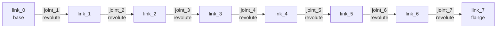

# cad2urdf

Convert CAD assemblies into ROS 2-ready URDF packages.

[](#testing) [](#install) [](#license) [](#status--roadmap)

`cad2urdf` takes mesh files (STL or OBJ today, STEP coming in v1.0) plus a YAML
joint description and emits a complete ROS 2 ament_cmake package — URDF + meshes
+ `package.xml` + `CMakeLists.txt` + `launch/display.launch.py` + `rviz/display.rviz`
— ready to drop into a workspace and view in RViz. Inertia is auto-computed
from each mesh using a user-supplied material density, validated by the user's
[ManipulaPy](https://github.com/boelnasr/ManipulaPy) URDF parser.

---

## Status & Roadmap

| Version | Status | Scope |
|---|---|---|
| **v0.1.0a0** (current) | shipping | CLI core: STL/OBJ in, full ROS package out, ManipulaPy validation gate |
| v1.0 | next | STEP/IGES via conda + pythonOCC-core; full assembly tree + mate extraction |
| v2.x | planned | LLM natural-language priors ("6-DOF arm with parallel-jaw gripper") |
| v3.x | planned | ML-based kinematic skeleton extraction (URDFormer-class) from raw meshes |
| v-future | planned | PyQt6 + VTK GUI; xacro / SDF / MJCF emitters; macOS + Windows packaging |

The full design lives in [`docs/superpowers/specs/2026-04-26-cad-to-urdf-converter-design.md`](docs/superpowers/specs/2026-04-26-cad-to-urdf-converter-design.md).
The v1-alpha implementation plan is at [`docs/superpowers/plans/2026-04-26-cad-to-urdf-v1-alpha-cli-core.md`](docs/superpowers/plans/2026-04-26-cad-to-urdf-v1-alpha-cli-core.md).

---

## Install

### Pip-only path (recommended for v0.1.0a0)

```bash
python3.10 -m venv .venv
source .venv/bin/activate
pip install -e ".[dev]"
```

Targets Python 3.10+ (matches Ubuntu 22.04 / ROS 2 Humble baseline). STL and OBJ
mesh inputs are fully supported. The CLI rejects `.step` / `.stp` inputs with a
clear error pointing back at this README — STEP support requires conda (see below)
and is wired in v1.0, not v1-alpha.

### Conda path (scaffolded for v1.0 STEP support)

```bash
conda env create -f environment.yml
conda activate cad2urdf
```

`pythonOCC-core` is not on PyPI; it's only distributed via conda-forge. The
`environment.yml` installs it alongside the pip extras so the runtime is ready
when v1.0 STEP-parsing code lands. Until then the conda env is functionally
equivalent to the pip-only path.

### ManipulaPy validation extra

```bash
pip install -e ".[dev,urdf-io]"
```

Adds the user's [ManipulaPy](https://github.com/boelnasr/ManipulaPy) library
(~3 GB transitive deps including PyTorch + CUDA wheels), enabling the post-emit
URDF validation gate. Without this extra, the CLI's `--no-validate` flag is
required (or you get a clean "ManipulaPy not installed" message and continue).

### ROS 2 Humble PYTHONPATH gotcha

If your shell sources ROS 2 Humble, its `PYTHONPATH` leaks into the venv and
crashes `pytest` collection (the `launch_testing` plugin imports `lark` which
isn't in the venv). Strip before testing:

```bash
unset PYTHONPATH AMENT_PREFIX_PATH
pytest
```

---

## Quick Start

```bash
# 1. Make two unit cubes (or use your own STL/OBJ files)
python -c "import trimesh; trimesh.creation.box(extents=(1,1,1)).export('cube_a.stl')"
python -c "import trimesh; trimesh.creation.box(extents=(1,1,1)).export('cube_b.stl')"

# 2. Describe the joints
cat > joints.yaml <<'EOF'
robot_name: two_cubes
base_link: cube_a
joints:
  - name: weld
    type: fixed
    parent: cube_a
    child: cube_b
    origin:
      xyz: [2.0, 0.0, 0.0]
      rpy: [0, 0, 0]
materials:
  cube_a: aluminum_6061
  cube_b: steel_1018
EOF

# 3. Convert
cad2urdf cube_a.stl cube_b.stl \
  --joints joints.yaml \
  -o two_cubes_description \
  --package-name two_cubes_description \
  --no-validate

# 4. Result
tree two_cubes_description/
# two_cubes_description/
# ├── CMakeLists.txt
# ├── launch/
# │   └── display.launch.py
# ├── meshes/
# │   ├── collision/{cube_a.stl, cube_b.stl}
# │   └── visual/{cube_a.stl, cube_b.stl}
# ├── package.xml
# ├── rviz/
# │   └── display.rviz
# └── urdf/
#     └── two_cubes.urdf
```

To view in RViz, drop the package into a ROS 2 workspace and run:

```bash
ros2 launch two_cubes_description display.launch.py
```

---

## Examples

Two complete, ready-to-inspect examples ship in [`examples/`](examples/). Each folder
contains the **source meshes** plus the **fully generated ROS 2 package** (URDF +
meshes + `package.xml` + `CMakeLists.txt` + launch + rviz), so you can either browse
the output directly or regenerate it yourself.

| Example | Links | Joints | What it shows |
|---|---|---|---|
| [`examples/two_cubes/`](examples/two_cubes/) | 2 | 1 × `fixed` | Smallest end-to-end run: two unit cubes welded together. Matches the Quick Start above. |
| [`examples/iiwa14/`](examples/iiwa14/) | 8 | 7 × `revolute` | KUKA LBR iiwa14 — a full 7-DOF serial arm with per-link inertia baked from real meshes. |

### `two_cubes` — minimal weld

```bash
cd examples/two_cubes
# Source meshes: cube_a.stl, cube_b.stl
# Pre-generated package: two_cubes_description/
ros2 launch two_cubes_description/launch/display.launch.py   # view in RViz
```

To regenerate from scratch, use the `joints.yaml` from the [Quick Start](#quick-start)
and run `cad2urdf cube_a.stl cube_b.stl --joints joints.yaml -o two_cubes_description --no-validate`.

### `iiwa14` — 7-DOF KUKA arm

The classic LBR iiwa14: a base (`link_0`) and seven revolute joints driving links
`link_1`–`link_7`. Source meshes live in [`examples/iiwa14/meshes/`](examples/iiwa14/meshes/);
the generated package is [`examples/iiwa14/iiwa14_description/`](examples/iiwa14/iiwa14_description/).



```bash
cd examples/iiwa14
ros2 launch iiwa14_description/launch/display.launch.py       # view the arm in RViz
```

---

## CLI Reference

```
cad2urdf <inputs>... --joints CONFIG.yaml -o OUT_DIR [options]
```

| Flag | Purpose |
|---|---|
| `<inputs>...` | One or more STL or OBJ files. Each file's stem becomes a link name. STEP inputs are rejected with a v1.0 message. |
| `-o, --out PATH` | Output directory. Will be created if missing. If pre-existing, **never** deleted on rollback (we only clean dirs we created). |
| `--joints PATH` | YAML config defining joint topology, axes, limits, and per-link materials (see schema below). |
| `--robot-name NAME` | Override `robot_name` from the joints YAML. |
| `--package-name NAME` | ROS package name. Must match `^[a-z][a-z0-9_]*$`. Defaults to `out_dir.name`. |
| `--maintainer NAME` | Maintainer name written into `package.xml` (XML-escaped). Default `cad2urdf-user`. |
| `--maintainer-email ADDR` | Maintainer email (XML-escaped via `quoteattr`). Default `user@example.com`. |
| `--no-validate` | Skip the ManipulaPy post-emit validation gate. Required if `manipulapy` isn't installed. |
| `-v, -vv` | Increase log verbosity (info, debug). |

Exit codes: `0` success, `2` error (config invalid, mesh load failed, joint structure invalid, write failed). Errors trigger automatic rollback of the output directory if we created it; pre-existing user directories are preserved.

---

## Joints YAML Schema

```yaml
# Required: top-level robot identity.
robot_name: my_arm                 # str, becomes the URDF <robot name=...>.
base_link: base                    # str, must be one of the input mesh stems.

# Required: list of joints. Each joint connects two links by name (= mesh stem).
joints:
  - name: shoulder                 # str, unique per robot.
    type: revolute                 # one of: revolute, prismatic, fixed, continuous, floating, planar
    parent: base                   # str, must be in the inputs.
    child: link_1                  # str, must be in the inputs and != parent.
    axis: [0.0, 0.0, 1.0]          # 3-element list of finite floats (auto-normalized).
    origin:
      xyz: [0.0, 0.0, 0.1]         # 3-element list of finite floats (meters).
      rpy: [0.0, 0.0, 0.0]         # 3-element list of finite floats (radians, fixed-axis).
    limits:                        # required for revolute/prismatic; rejected if missing.
      lower: -3.14                 # finite float.
      upper:  3.14                 # finite float, >= lower.
      effort: 100.0                # finite float, Nm or N.
      velocity: 2.0                # finite float, rad/s or m/s.

# Optional: per-link material override (default: aluminum_6061).
materials:
  base: aluminum_6061
  link_1: steel_1018
```

Validation enforces structural correctness (top-level mapping, required string fields, axis length=3, origin xyz/rpy length=3, materials dict[str,str]) and rejects non-finite numerics (`.nan`, `.inf`). Errors point at the offending YAML key with the file path and joint index.

---

## Materials

The default material table ships at [`config/materials.json`](config/materials.json) with 7 presets:

| Name | Density (kg/m³) | Notes |
|---|---|---|
| `aluminum_6061` | 2700 | Default if no material specified. Light, common for robotics chassis. |
| `steel_1018` | 7850 | Mild steel; cheap, heavy. |
| `stainless_304` | 8000 | Slightly denser than 1018; corrosion-resistant. |
| `titanium` | 4500 | Aerospace-grade; expensive but strong. |
| `pla` | 1240 | Most common 3D-print filament. |
| `abs` | 1050 | Tougher 3D-print plastic; less common. |
| `carbon_fiber` | 1600 | Composite; treated as bulk density (anisotropy ignored). |

Each entry also defines an RGBA color used in the URDF `<material>` block, surfaced in RViz / Gazebo.

To use a custom material, add it to `config/materials.json` (the loader caches the result per process via `@cache`). The returned table is wrapped in `MappingProxyType` so callers can't accidentally corrupt the global table.

---

## Pipeline Architecture

```
┌──────────────┐     ┌───────────────┐     ┌──────────────┐     ┌──────────────┐
│ STL/OBJ      │     │ joints.yaml   │     │ materials    │     │  ManipulaPy  │
│ inputs       │     │ + materials   │     │  (cached)    │     │ (optional)   │
└──────┬───────┘     └───────┬───────┘     └──────┬───────┘     └──────┬───────┘
       │                     │                    │                    │
       ▼                     ▼                    ▼                    │
┌────────────────────────────────────────────────────┐                 │
│  core/parsers + core/config.loader                 │                 │
│  • trimesh.load → Trimesh                          │                 │
│  • YAML → JointSpec + JointsConfig (schema-checked)│                 │
└──────────────────────────┬─────────────────────────┘                 │
                           ▼                                           │
            ┌──────────────────────────────┐                           │
            │ core/inertia.compute         │                           │
            │ mesh + density → mass/com/I  │                           │
            │ (mesh.copy() — no mutation)  │                           │
            └──────────────┬───────────────┘                           │
                           ▼                                           │
            ┌──────────────────────────────┐                           │
            │ core/kinematic.model.Robot   │                           │
            │ Link + Joint + InertialOver- │                           │
            │ ride dataclasses (frozen-ish)│                           │
            └──────────────┬───────────────┘                           │
                           ▼                                           │
            ┌──────────────────────────────┐                           │
            │ core/kinematic.validate      │                           │
            │ cycles, dangling, multi-     │                           │
            │ parent, missing base         │                           │
            └──────────────┬───────────────┘                           │
                           ▼                                           │
            ┌──────────────────────────────┐                           │
            │ core/urdf.emit (single pass) │                           │
            │ Robot AST → URDF 1.0 XML     │                           │
            │ (deterministic, package://)  │                           │
            └──────────────┬───────────────┘                           │
                           ▼                                           │
            ┌──────────────────────────────┐                           │
            │ core/urdf.package            │                           │
            │ ROS scaffolding (pkg.xml,    │                           │
            │ CMakeLists, launch.py, rviz) │                           │
            └──────────────┬───────────────┘                           │
                           ▼                                           │
            ┌──────────────────────────────┐                           │
            │ <out_dir>/                   │ ◀─────────────────────────┘
            │  ├── urdf/<robot>.urdf       │  (optional validation:
            │  ├── meshes/{visual,         │   parse the URDF back via
            │  │           collision}/     │   ManipulaPy.URDFToSerial-
            │  ├── package.xml             │   Manipulator and confirm
            │  ├── CMakeLists.txt          │   IK + dynamics objects
            │  ├── launch/                 │   construct cleanly)
            │  └── rviz/display.rviz       │
            └──────────────────────────────┘
```

**Key invariants:**

- The `Robot` dataclass is the **single source of truth** between parsing and emission. All transformations operate on it.
- `core/` has zero `Qt` or `VTK` imports (enforced by file structure; the `gui/` package will be additive in v-future).
- URDF mesh paths are always `package://<pkg>/<rel>` — absolute paths and `..` segments are rejected at the boundary.
- `package_name` is validated against ROS naming rules (`^[a-z][a-z0-9_]*$`); `urdf_relpath` components must match `^[a-zA-Z0-9_.-]+$` to prevent template injection into generated launch.py.
- Maintainer fields are XML-escaped via `xml.sax.saxutils.escape` and `quoteattr`.

---

## Project File Format (`.cad2urdf`)

The CLI is stateless, but `core/project/save.py` exposes `save_project(robot, path)` and `load_project(path)` for tools that want to round-trip a `Robot` AST as JSON:

```json
{
  "schema_version": 1,
  "name": "my_arm",
  "base_link": "base",
  "links":  [ {"name": "...", "visual_mesh_path": "...", ...} ],
  "joints": [ {"name": "...", "type": "revolute", ...} ]
}
```

Schema migrations live in a `_MIGRATIONS: dict[(int,int), Callable]` registry — empty in v1, populated when `SCHEMA_VERSION` bumps. Loading an unsupported version raises with a pointer to the registry file.

---

## Development

### Run the test suite

```bash
unset PYTHONPATH AMENT_PREFIX_PATH    # strip ROS leakage
pytest                                # 124 unit + integration tests
pytest -m slow                        # ManipulaPy validation tests (need [urdf-io])
```

### Type-check

```bash
mypy                                  # strict mode on src/cad2urdf/core/
```

The type checker is clean on every committed revision; CI enforces this gate.

### Project layout

```
cad2urdf/
├── src/cad2urdf/
│   ├── core/                         # zero Qt/VTK imports — drives the CLI
│   │   ├── kinematic/                # Robot/Link/Joint/InertialOverride + tree + validate
│   │   ├── parsers/                  # stl, obj (step coming in v1.0)
│   │   ├── extract/                  # types.AssemblyEdge, mate_classify, spanning_tree
│   │   ├── inertia/                  # materials table, mass/COM/inertia compute
│   │   ├── meshing/                  # OCC tessellation hook (v1.0)
│   │   ├── urdf/                     # emit (URDF 1.0 XML), package (ROS scaffolding)
│   │   ├── validation/               # manipulapy_gate (lazy-import)
│   │   ├── project/                  # save/load .cad2urdf JSON
│   │   └── config/                   # loader (joints YAML schema)
│   └── cli/main.py                   # argparse + 7-phase pipeline orchestrator
├── tests/
│   ├── unit/                         # 110 tests, one file per core module
│   └── integration/                  # 4 tests, end-to-end CLI runs
├── config/materials.json             # default density table
├── docs/superpowers/                 # specs/ + plans/ — design source of truth
├── pyproject.toml                    # Python 3.10+, manipulapy in [urdf-io] extra
├── environment.yml                   # conda scaffolding for v1.0 STEP path
└── README.md
```

### Contributing

1. Fork + branch.
2. Make changes; add tests proving the new behavior.
3. `unset PYTHONPATH AMENT_PREFIX_PATH && pytest && mypy` — must be green.
4. Open a PR. Expect a Codex independent review (`/codex review`) before merge.

---

## Why This Project Exists

The robotics URDF tooling landscape is split between proprietary CAD plugins
(SolidWorks-to-URDF, Fusion-to-URDF, Onshape-to-URDF) and free tools that
require manual joint authoring inside a CAD package (FreeCAD CROSS, Phobos for
Blender). `cad2urdf` is the **scriptable middle ground**: take meshes you
already have, describe the kinematics in 20 lines of YAML, and get a complete
ROS package out — no GUI, no proprietary CAD license, no manual XML.

The eventual v3 ML pipeline aims to remove the YAML step too, by inferring the
joint tree directly from the geometry. But shipping the boring deterministic
core first means the ML predictions can be diffed against, edited, and verified
by a system that already works.

---

## License

MIT. See `pyproject.toml`.

## Acknowledgements

Built on top of [trimesh](https://github.com/mikedh/trimesh),
[pythonOCC-core](https://github.com/tpaviot/pythonocc-core) (v1.0+),
[ManipulaPy](https://github.com/boelnasr/ManipulaPy), and the
[ROS 2](https://docs.ros.org/) ecosystem.
