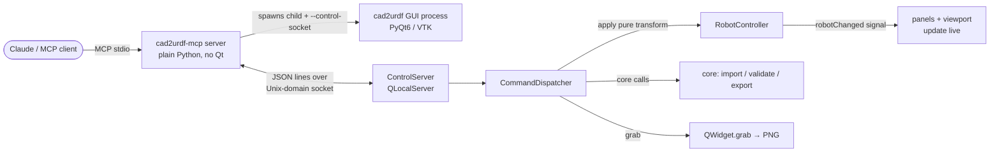

# cad2urdf GUI MCP Server — Design

**Date:** 2026-06-06
**Status:** Approved (brainstorming complete, pending implementation plan)
**Related:** [[2026-04-26-cad-to-urdf-converter-design]] (core converter), GUI under `src/cad2urdf/gui/`

## Goal

Give Claude (or any MCP client) the ability to **operate the real cad2urdf GUI
end-to-end**: launch the PyQt6/VTK application, build and edit a robot through
the same code paths a human uses, and observe the live window via on-demand
screenshots. The human can watch the window update in real time as Claude works.

## Decisions (locked during brainstorming)

| Decision | Choice |
|---|---|
| Connection model | **Launch & control GUI** — the MCP server spawns the GUI as a child process and drives the live window. |
| Control method | **Semantic command bridge** — high-level commands marshalled onto the Qt main thread and applied via `RobotController`. No simulated mouse/keyboard. |
| Command surface | Full v1: state introspection, import & build, joint editing, project I/O & export. |
| Screenshot delivery | **On-demand only** — a dedicated `screenshot` tool returns an inline PNG; no automatic screenshots on other tools. |
| Transport | **A — `QLocalServer` + JSON-lines** over a Unix-domain socket. |
| GUI lifecycle | **Auto-spawned** by the MCP server (lazily on first tool use). |

## Architecture

Two processes communicating over a local socket:

- The **MCP server process** holds no Qt. It spawns the GUI, owns the socket
  client, and exposes MCP tools. Uses Python's stdlib `socket` for the
  Unix-domain connection.
- The **GUI process** runs the existing app plus an embedded `ControlServer`.
  Because `QLocalServer` lives in the Qt event loop, commands arrive **already
  on the Qt main thread**, so `RobotController.apply()` is called directly with
  no cross-thread marshalling.

### Why transport A

`QLocalServer` is the only option where the Qt threading model works *for* us:
the command handler runs on the main thread, so it can touch widgets and the
controller directly. TCP (option B) adds port management and a loopback port;
an HTTP thread (option C) lands requests on a background thread that must hop to
the main thread via `QMetaObject.invokeMethod` — more concurrency surface for no
gain. The GUI side needs zero extra dependencies; the MCP side uses stdlib.

## Components

### New modules

| Module | Responsibility | Qt? |
|---|---|---|
| `gui/control/protocol.py` | Shared message schema: command names, request/response shapes, JSON-lines framing constants. Single source of truth for both processes. | No |
| `gui/control/dispatcher.py` | `CommandDispatcher`: command dict → `RobotController` / `core` calls → result dict. **No socket code** — unit-testable headlessly. | Touches `RobotController` (QObject) but no socket |
| `gui/control/server.py` | `ControlServer`: wraps `QLocalServer`, frames/parses JSON lines, delegates to the dispatcher, writes responses. | Yes |
| `mcp/client.py` | Stdlib-socket JSON-lines client used by the MCP server. | No |
| `mcp/server.py` | FastMCP server: tool definitions, GUI subprocess lifecycle, socket-path management. | No |
| `mcp/__main__.py` | Entry point for the `cad2urdf-mcp` console script. | No |

### Wiring into the existing GUI

- Add a `--control-socket PATH` CLI flag to the GUI entry point (`gui/app.py`).
- When the flag is present, `app.py` constructs the main window as usual, then
  starts `ControlServer` listening on `PATH` after the window is shown.
- When the flag is absent, behaviour is **unchanged** — normal human launches
  never start the control server.

### GUI lifecycle (MCP side)

- The MCP server picks a socket path in a temp dir, spawns
  `cad2urdf-gui --control-socket <path>` as a child process, and waits for the
  socket to become connectable (bounded poll with timeout).
- Spawn is **lazy**: the GUI starts on the first tool call that needs it; a
  `gui_status` tool reports whether it is running. On MCP server shutdown the
  child GUI is terminated and the socket file removed.

## Reuse (not reinvent)

- **Edits** map to the same pure transforms in `core/kinematic/tree.py` that the
  panels already invoke through `controller.apply(transform, label=...)`. Result:
  every Claude edit renders live, lands on the undo stack, and gets undo/redo for
  free.
- **Introspection** serializes the `Robot` AST via the existing
  `core/project/save.py` (`Robot → JSON`, `schema_version 1`).
- **Import / validate / export** reuse the existing `QThread` workers under
  `gui/workers/`, awaited synchronously via the `QEventLoop` blocking pattern
  already established in the codebase, so the dispatcher returns only after the
  worker completes.

## MCP tool surface (v1)

| Group | Tools | Maps to |
|---|---|---|
| Introspect | `get_robot`, `list_materials`, `get_history` | `save_project` serialize, materials table, controller history |
| Build | `import_meshes`, `set_base_link`, `rename_link`, `remove_link`, `set_link_material` | import worker + `tree.py` transforms |
| Joints | `add_joint`, `update_joint`, `remove_joint` | `tree.py` transforms via `controller.apply` |
| Project / export | `save_project`, `open_project`, `validate`, `export_package` | `core/project`, validation worker, export worker |
| Control / visual | `screenshot`, `undo`, `redo`, `gui_status` | `QWidget.grab`, controller undo/redo, lifecycle |

- `update_joint` covers type, axis, origin (xyz/rpy), limits, and parent/child in
  one tool with optional fields, mirroring the joint editor panel.
- `screenshot` grabs the live main window (`QWidget.grab()` → PNG) and returns it
  as MCP **image content**. Returned only when explicitly called.

## Data flow (one command)

1. Claude calls an MCP tool → `mcp/server.py`.
2. Server ensures the GUI is running (lazy spawn), then sends a framed JSON
   command via `mcp/client.py` over the socket.
3. `ControlServer` (GUI main thread) reads the line, parses it, validates the
   command name against `protocol.py`, and calls `CommandDispatcher.dispatch`.
4. Dispatcher executes: pure transform via `controller.apply`, or a worker run,
   or a screenshot grab, or a read. It returns a result dict.
5. `ControlServer` writes the framed JSON response back over the socket.
6. The MCP tool returns the result (text, or image content for `screenshot`).

## Error handling

- The dispatcher wraps each command in try/except and returns
  `{ok: false, error: <code>, detail: <message>}`. A bad command (invalid joint,
  cyclic topology, missing mesh) **never crashes the GUI** — the existing
  validation in `core/kinematic/validate.py` and the transforms raise, and the
  dispatcher converts to an error envelope.
- Unknown command names are rejected before dispatch using the `protocol.py`
  registry.
- Socket framing errors, connection loss, or a dead GUI surface as clear MCP tool
  errors on the server side, including spawn-timeout and "GUI not running".
- The MCP server validates and resolves mesh/project paths before forwarding;
  core's existing path-safety checks (`package://`, no `..`) remain the final gate.

## Security & isolation

- Unix-domain socket in a per-session temp dir — **no network exposure**, no
  loopback port.
- `core/` retains zero Qt/VTK imports; the new `gui/control/` package depends on
  Qt and the controller, consistent with the existing `core` ↔ `gui` boundary.
- The `mcp` SDK is added as a new **optional extra** `[mcp]`, kept out of the
  core install (consistent with the `[urdf-io]` extra policy).

## Testing strategy

1. **`CommandDispatcher` (headless unit):** construct a `RobotController`, feed
   command dicts, assert resulting `Robot` state and error envelopes. No socket,
   no MCP, no window — the bulk of behavioural coverage lives here.
2. **`ControlServer` (pytest-qt, offscreen):** real `QLocalSocket` round-trip —
   send a framed command, assert the framed response. Uses the viewport's
   existing headless fallback.
3. **MCP tool layer (unit):** each tool builds the correct command dict and maps
   the response correctly (socket client mocked).
4. **End-to-end (one test):** MCP server spawns an offscreen GUI, runs
   import → add_joint → export, and asserts a ROS package is written to disk.

## YAGNI cuts (v1)

- No fine-grained inertia-editor tools — inertia is auto-baked on export and
  `set_link_material` covers density selection.
- No camera/viewport control tools.
- No automatic screenshots (on-demand only).
- No multi-robot / multi-window support.
- No remote/network transport.

## Open questions for the implementation plan

- Exact framing: newline-delimited JSON vs length-prefixed (lean newline-delimited
  for simplicity; revisit if mesh-heavy payloads appear — meshes are passed by
  path, not inline, so payloads stay small).
- Whether `screenshot` captures the whole `QMainWindow` or just the VTK viewport
  (default: whole window; a `region` arg can be a later addition).
