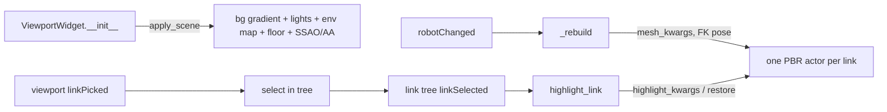

# "Studio" Viewport Styling — Design

**Date:** 2026-06-13
**Status:** Approved (brainstorming complete, pending implementation plan)
**Related:** [[2026-06-06-gui-mcp-server-design]] (the viewport was built here), [[2026-06-13-joint-editor-origin-fields-design]] (sibling GUI improvement); builds on the forward-kinematics viewport fix (commits `fd43e79` / `e6a667a`)

## Goal

Replace the flat developer-look 3D viewport — `lightgray`, faceted (flat
shading), plain white background, wireframe bounding box, single default light —
with a polished **metallic "studio" render** in the live GUI, while keeping the
links pickable/distinguishable during editing via a selection highlight.

## Background

`ViewportWidget._rebuild` (`src/cad2urdf/gui/viewport/widget.py`) currently adds
each link mesh with `color="lightgray", show_edges=False` and no shading or
lighting setup; `__init__` sets a white background, `show_axes`, `show_grid`.
The widget already places meshes at their world pose via `link_world_transforms`.

Selection today: `dock_link_tree.linkSelected(str)` drives the joint/inertia
editors; the viewport emits `linkPicked(str)` which `MainWindow` routes back into
the tree. There is **no** visual highlight of the selected link in the viewport.

Environment: pyvista 0.48 / VTK 9.6 — supports PBR, `set_environment_texture`,
`enable_ssao`, `enable_anti_aliasing("ssaa")`, `enable_shadows`, `add_floor`.

## Decisions (locked during brainstorming)

| Decision | Choice |
|---|---|
| Direction | **Studio** — PBR brushed-metal, soft backdrop, ground shadow (chosen over per-link "engineering" and matte from rendered comparisons). |
| Link distinguishability | **Selection highlight** — selected link rendered in a contrasting highlight (mitigates uniform metal). **In scope.** |
| Metal reflections | **Runtime-generated environment map** (no bundled HDR / no network). Fallback: light-kit-only with a lighter metal. **In scope.** |
| Heavy effects under offscreen | Apply SSAO + shadows **only on a real display** (`not pyvista.OFF_SCREEN`); cheap styling always — keeps offscreen tests green and quiet. |
| Code organization | Isolated `ViewportStyle` (params + apply helpers); `widget.py` consumes it. |

## Components

### 1. `gui/viewport/style.py` (new) — `ViewportStyle`
A small module holding the look in one place: material params (metal base color,
`metallic`, `roughness`), background gradient colors, highlight color, light-kit
config, and helpers:
- `apply_scene(plotter, *, offscreen: bool)` — background gradient, light kit,
  environment map (see #4), floor + shadow, SSAO, SSAA. Skips SSAO/shadows when
  `offscreen`.
- `mesh_kwargs()` — the `add_mesh` styling kwargs (smooth_shading, pbr, metallic,
  roughness, base color) for a normal link.
- `highlight_kwargs()` — styling for the selected link.

### 2. `gui/viewport/widget.py` — consume the style
- `__init__`: call `ViewportStyle.apply_scene(self.plotter, offscreen=pv.OFF_SCREEN)`
  in place of the current `set_background/show_axes/show_grid`. Keep an
  orientation axes widget (`add_axes`).
- `_rebuild`: add each mesh with `ViewportStyle.mesh_kwargs()` (still one actor
  per link, still FK-transformed). Re-apply the highlight to the selected link if
  one is set.
- New `highlight_link(self, name: str | None)`: restyle the previously-selected
  actor back to normal and the newly-selected actor with `highlight_kwargs()`;
  store `self._selected`.

### 3. `gui/windows/main_window.py` — wire the highlight
Add `self.dock_link_tree.linkSelected.connect(self.viewport.highlight_link)` so
both tree selection and viewport picking (which loops through the tree) highlight
the active link.

### 4. Runtime environment map
Generate a simple studio environment (e.g. a vertical gradient / soft cubemap)
from numpy at startup → `pv.Texture` → `plotter.set_environment_texture(...)`, so
PBR metal shows reflections instead of reading flat black. Wrapped in
try/except: on any failure, fall back to light-kit-only and a lighter,
higher-roughness metal so the scene still looks good.

## Data flow

## Error handling

All GPU-feature calls (env map, SSAO, shadows, AA, PBR) are individually guarded;
any unsupported feature is skipped without breaking the viewport. `highlight_link`
is a no-op for unknown/None names and when the link has no actor (e.g. placeholder
links with non-absolute mesh paths).

## Testing (TDD)

Offscreen (`pv.OFF_SCREEN`, as in `tests/gui/conftest.py`):
- Widget builds with styling applied and **no error**; still one actor per link
  (existing viewport tests stay green); output stays quiet (heavy effects gated).
- `highlight_link("arm")` changes the arm actor's appearance vs a normal link and
  restores it when selection moves/clears.
- `ViewportStyle.mesh_kwargs()` / `highlight_kwargs()` return distinct styles.

Manual verification on the real display: relaunch the GUI with the iiwa14 build
and confirm the studio look + selection highlight.

## Out of scope

Multiple switchable themes; per-link/material-based coloring; bundled HDR/IBL
image assets; viewport drag gizmos.
